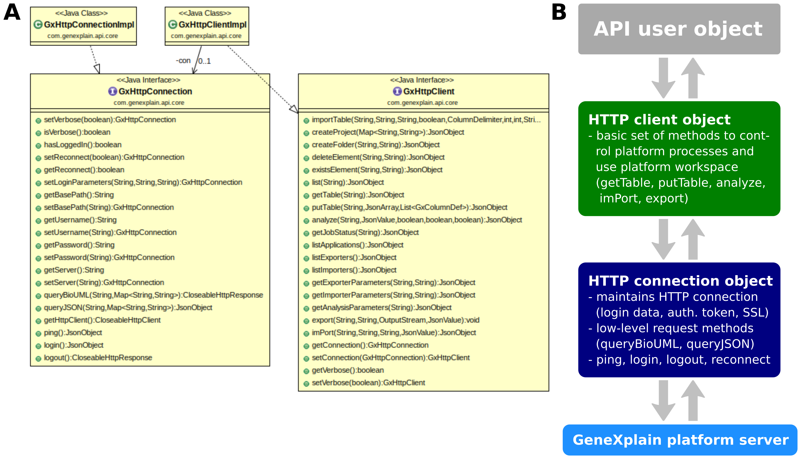

# Using the Java API

The Java API has two main interfaces, `com.genexplain.api.core.GxHttpConnection` and `com.genexplain.api.core.GxHttpClient` and there are two basic implementations provided by `com.genexplain.api.core.GxHttpConnectionImpl` and `com.genexplain.api.core.GxHttpClientImpl` (see also Fig. 1).
The _GxHttpConnection_ manages a connection to a geneXplain platform server and provides low level methods to send requests to the server. The _GxHttpClient_ requires a _GxHttpConnection_ to be able to provide higher level functions, e.g., to submit analysis jobs, import or export data. The core functionality of the API is contained in the package _com.genexplain.api.core_.

 Figure 1. A) Two core interfaces providing a connection to a platform server and a client as well as their implementations. B) Overview of the roles of core classes in a program using the API.

A program firstly creates a _GxHttpConnection_ which is given authentication info and the address of the server to connect with (Fig. 1B). The connection object is then provided to the _GxHttpClient_ to do its work. Several example programs in the package _com.genexplain.api.eg_ demonstrate how to use the API. The described workflow of obtaining a connection and a client can be seen at work in the _connect()_ method of the class `com.genexplain.api.eg.AbstractAPIExample`.

