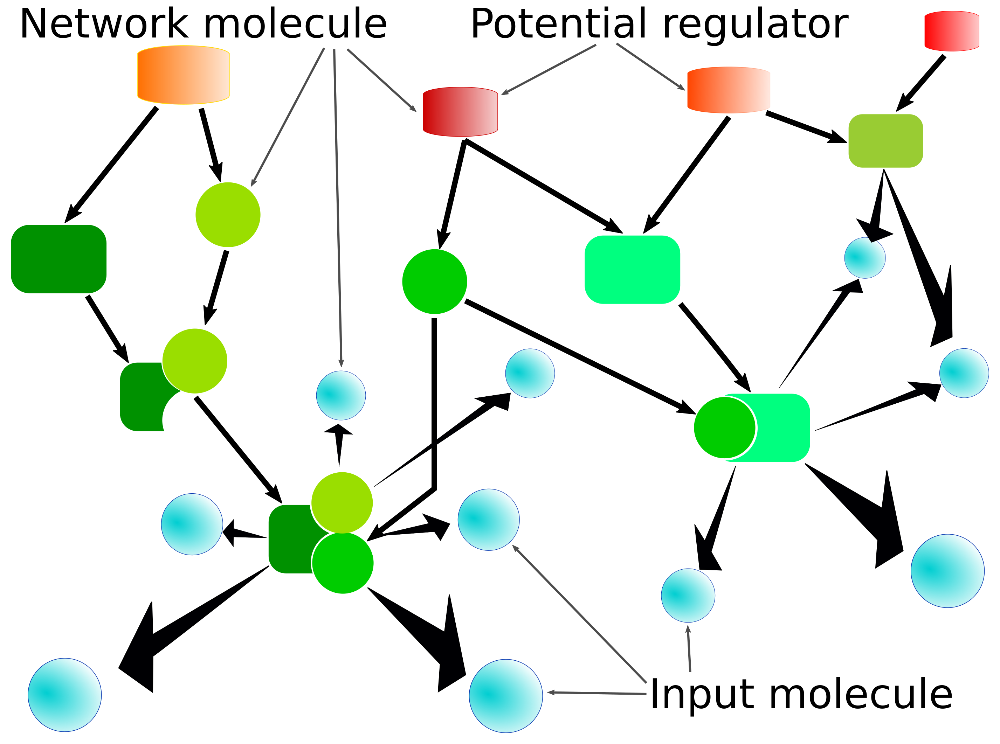
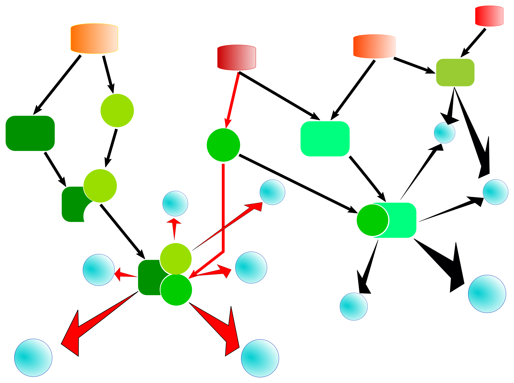
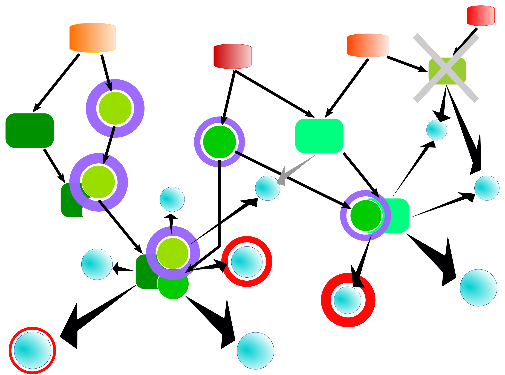

# JAR application manuals

## example - Example applications using the Java API

Several examples show how to use the Java API. They can be listed by invoking the JAR with the _example_ command. All of the example sources can be found in the package _com.genexplain.api.eg_.

```Bash
genexplain-api$ java -jar build/libs/genexplain-api-1.0.jar example
INFO  com.genexplain.api.app.APIRunner - Running command example
INFO  com.genexplain.api.eg.ExampleRunner - createFolder - Creates a folder within the demo workspace and prints out the server response (com.genexplain.api.eg.CreateFolderExample)
INFO  com.genexplain.api.eg.ExampleRunner - extractGeneClasses - Extracts gene classes from a functional classification result applying criteria for filtering (com.genexplain.api.eg.ExtractFunctionalClassGenesExample)
INFO  com.genexplain.api.eg.ExampleRunner - getParameters - Fetches parameter descriptions for a specified analysis tool (com.genexplain.api.eg.GetParametersExample)
INFO  com.genexplain.api.eg.ExampleRunner - getTable - Gets a JSON response representing a data table and prints it to standard output (com.genexplain.api.eg.GetTableExample)
INFO  com.genexplain.api.eg.ExampleRunner - importTable - Imports a table to the specified path (com.genexplain.api.eg.ImportTableExample)
INFO  com.genexplain.api.eg.ExampleRunner - listAFolder - Gets a JSON response representing the contents of the data/Projects folder (com.genexplain.api.eg.ListAFolderExample)
INFO  com.genexplain.api.eg.ExampleRunner - putTable - Stores a table under the specified path (com.genexplain.api.eg.PutTableExample)
INFO  com.genexplain.api.eg.ExampleRunner - tfbsAnalysisForFolder - Analyzes binding site enrichment for all gene sets in a folder (com.genexplain.api.eg.TfbsAnalysisForFolderExample)
INFO  com.genexplain.api.eg.ExampleRunner - zipImport - Imports multiple files of same type as a ZIP archive (com.genexplain.api.eg.ZipImportExample)
```

Each listed item represents an example that can be invoked by adding its name to the commandline, e.g. _listAFolder_:

```Bash
genexplain-api$ java -jar build/libs/genexplain-api-1.0.jar example listAFolder
INFO  com.genexplain.api.app.APIRunner - Running command example                                                                                                                                                 
INFO  c.g.api.core.GxHttpConnectionImpl - Trying to log in                                                                                                                                                       
INFO  c.g.api.eg.ListAFolderExample - {"names":[{"hasChildren":true,"permissions":3,"name":"CRC_6_CpG_biomarkers","protection":2,"class":0},{"hasChildren":true,"permissions":7,"name":"Demo project","protection":2,"class":0},{"hasChildren":true,"permissions":3,"name":"MTX resistance","protection":2,"class":0}],"size":3,"classes":["biouml.model.Module"],"from":0,"to":3,"enabled":true}
```

The example applications _extractGeneClasses_, _tfbsAnalysisForFolder_ and _zipImport_ require a configuration file in JSON format as additional commandline argument. Please refer to their class source codes (`com.genexplain.api.eg.ExtractFunctionalClassGenesExample`,  `com.genexplain.api.eg.TfbsAnalysisForFolderExample`, `com.genexplain.api.eg.ZipImportExample`) for descriptions of the configurable parameters. Runnable example JSON files are provided in the _docs/tutorial_ folder of the source repository. They are also shown below. Please note that some parts have been abbreviated.

The _extractGeneClasses_ demo extracts gene sets from the functional classification result specified by `funClassTable` firstly to a local folder named _fun_class_gene_sets_ (specified by `geneSetFolder`) and imports them to an output folder (`outputFolder`) in _data/Projects/Demo project/Data_ (`geneSetPath`) using the default result folder name (_fun_class_gene_sets_).

```JSON
{
    "funClassTable":  "data/Examples/TNF-stimulation of HUVECs GSE2...",
    "localTableFile": "funclass_table.txt",
    "minGroupSize": 50,
    "maxGroupSize": 1500,
    "minHits": 30,
    "maxHits": 150,
    "maxAdjustedPval": 1e-10,
    "geneSetFolder": "fun_class_gene_sets",
    "geneSetPath": "data/Projects/Demo project/Data"
}
```
The _tfbsAnalysisForFolder_ demo conducts a [search for enriched transcription factor binding sites](https://platform.genexplain.com/bioumlweb/#de=analyses/Methods/Site%20analysis/Search%20for%20enriched%20TFBSs%20(genes)) for all gene sets of a folder (`inputFolder`). Gene sets of interest can be recognized by a regular expression (`inputRegex`), which defaults to `.+` if omitted from the configuration. The gene set for comparison (`noSet`) is a table with Ensembl gene ids which shouldn't overlap with the gene sets of interest.

```JSON
{
	"inputFolder":    "data/Examples/TNF-stimulation of HUVECs GSE2...",
    "inputRegex":     ".+response.+",
	"outputFolder": "data/Projects/Demo project/Data/TFBS analysis for folder",
    "noSet": "data/Examples/TNF-stimulation of HUVECs GSE2...",
	"profile": "databases/TRANSFAC(R) (public)/Data/profiles/vertebrate_human_p0.001",
	"doSample": true,
	"sampleNum": 5,
	"sampleSize": 1000,
	"from": -1000,
	"to": 100,
	"siteFeCutoff": 1.1,
	"siteFdrCutoff": 1e-4,
	"seqFeCutoff": 1.0,
	"seqFdrCutoff": 0.05
}
```
The demo application _zipImport_ imports a ZIP archive containing multiple files of the same type into the platform workspace. Besides login credentials, the local path of the archive and the platform destination folder one needs to specify the parameters for the file type-specific importer. Importer parameters for two frequent use cases, gene tables and CEL files, are also given in the source code. Parameters of the JSON shown below may require adaptation.

```JSON
{
	"user": "optional user name",
	"password": "optional password",
	"server": "optional server URL",
	"zipArchive": "local_example_archive.zip",
	"outputFolder": "destination folder in platform",
	"importParams": [
          {"name":"cleanupFolder","value":false},
          {"name":"preserveExtension","value":false},
          {"name":"preserveArchiveStructure","value":false},
          {"name":"importFormat","value":"Affymetrix CEL file (*.cel)"}
	]
}
```

## apps - Listing available tools

The application named _apps_ produces a listing of the available analysis tools on a certain server. It takes a single argument that specifies
a file containing a JSON object with several properties of which only the _server_ property is required. Example output:

```Bash
genexplain-api$ java -jar build/libs/genexplain-api-1.0.jar apps json/application_lister_demo.json 
INFO  com.genexplain.api.app.APIRunner - Running command apps
Data manipulation/Annotate diagram
Data manipulation/Annotate table
Data manipulation/Annotate track with genes
Data manipulation/Composite module to proteins
Data manipulation/Convert table
Data manipulation/Convert table to track
Data manipulation/Convert table via homology
Data manipulation/Create folder
Data manipulation/Create miRNA promoters
Data manipulation/Create random track
Data manipulation/Create tissue-specific promoter track
Data manipulation/Create transcript region track
Data manipulation/Filter one track by another
Data manipulation/Filter table
Data manipulation/Filter track by condition
Data manipulation/Gene set to track
[...]
```

The parameters that can be specified with the JSON input file are described in the following table.

| Parameter                                    | Description                                           |
|----------------------------------------------|-------------------------------------------------------|
| **server**                                   | Server URL to connect to                              |
| **user**                                     | Username to use for connection                        |
| **password**                                 | Password that belongs to the username                 |
| **withParameters**                           | If `true` will produce tsv-table of tools and their parameters |
| **withGalaxy**                               | If `true` will also include tools integrated from Galaxy |
| **outfile**                                  | Output file. Prints to standard output if `outfile` is absent or empty |
| **connection**                               | Package and name to locate a Java class to use for connection. This class must implement _com.genexplain.api.core.GxHttpConnection_. |
| **client**                                   | Package and name to locate a Java class to use as platform client. This class must implement _com.genexplain.api.core.GxHttpClient_. |


## parameters - Parameter descriptions for platform and Galaxy tools

The _parameters_ application fetches parameter descriptions in JSON format for one or more tools from a platform server. It takes a single argument that specifies
a file containing a JSON object with several properties of which only the _server_ property is required. The output is a JSON object containing the tool names
as keys as the retrieved parameter descriptions as values.


| Parameter                                    | Description                                           |
|----------------------------------------------|-------------------------------------------------------|
| **server**                                   | Server URL to connect to                              |
| **user**                                     | Username to use for connection                        |
| **password**                                 | Password that belongs to the username                 |
| **tools**                                    | JSON array with tool names                            |
| **outfile**                                  | Output file. Prints to standard output is `outfile` is absent or empty |
| **connection**                               | Package and name to locate a Java class to use for connection. This class must implement _com.genexplain.api.core.GxHttpConnection_. |
| **client**                                   | Package and name to locate a Java class to use as platform client. This class must implement _com.genexplain.api.core.GxHttpClient_. |


## regulator-search - Regulator (and effector) search tool

The _regulator-search_ is a molecular network analysis tool that searches for important signaling molecules that may regulate the activity of input molecules. One can also search for common effectors of input molecules, which is called effector search. While this application is just named after the search for regulators, it offers both options. Here we introduce the overall concept, input data and parameters. Research articles describe the algorithm in more detail.

The basis for this network analysis is formed by a database which describes the molecular network consisting of molecules and molecular complexes (nodes) and their interactions as well as biochemical reactions (edges). Such a network is illustrated in the following figure.



A set of input molecules is located within the network (blue nodes), and many of them are connected via one or more (directed) interaction/reaction steps. In the regulator search, those nodes from which _outgoing_ reaction cascades can reach one or more input molecules are potential regulators, whereas in the effector search the cascades start from the input molecules and are _incoming_ from the point of a potential effector.

The algorithm searches for target (effector or regulator) nodes within a specified maximal number of interaction/reaction steps. An illustration of such a search path connecting input molecules and an upstream regulator is shown in the following figure.



To prioritize potential target nodes, the search routine calculates a score for each of them. The score takes into account several parameters such as the number of hits in the input set or the number of hits outside of the input set within the same search distance. Optionally, one can also specify weights for the input molecules as well as so-called _decorations_ of the molecular network which can be used to associate weights with all network molecules, to add new interactions/reactions between molecules, or to omit nodes from the network as depicted in the following figure.

.

To obtain a normalized score, one can choose to run the algorithm for randomized input sets with other parameters fixed  and to calculate a Z-score as well as a FDR.

This application can either invoke the analysis on a specified platform server or just print out a corresponding JSON configuration. The printed JSON can be used with the _exec_ command e.g. as part of a pipeline.

### Parameters

| Parameter                                    | Description                                           |
|----------------------------------------------|-------------------------------------------------------|
| **searchEffectors**                          | Set `true` to do effector (downstream from inputs) instead of regulator (upstream from inputs) search |
| **server**                                   | Server URL to connect to                              |
| **user**                                     | Username to use for connection                        |
| **password**                                 | Password that belongs to the username                 |
| **verbose**                                  | Set `true` get more progress info                     |
| **reconnect**                                | Set `true` to allow attempts to reconnect in case the connection is interrupted |
| **connection-class**                         | Package and name of a Java class that extends com.genexplain.api.core.GxHttpConnection and will be used instead of the standard class |
| **client-class**                             | Package and name of a Java class that extends com.genexplain.api.core.GxHttpClient and will be used instead of the standard class |
| **replaceStrings**                           | Define string labels to be replaced by specified input parameters |
| **sourcePath**                               | Platform path of the input molecule set |
| **weightColumn**                             | Name of column in input table to assign weights to molecules (optional) |
| **isInputSizeLimited**                       | Set `true` to apply the input size limit |
| **inputSizeLimit**                           | Use only the first specified number of input molecules |
| **maxRadius**                                | Max. number of reaction steps that may connect input molecules and regulator/effector |
| **scoreCutoff**                              | Score cutoff to filter regulators |
| **bioHub**                                   | Database with molecular network that are applied in the analysis |
| **species**                                  | Species of input molecules |
| **calculatingFDR**                           | Set `true` to calculate FDR for regulators |
| **FDRcutoff**                                | FDR cutoff to filter regulators |
| **ZScoreCutoff**                             | Z-score cutoff to filter regulators |
| **penalty**                                  | Penalty factor for false positives, that is molecules connected to a regulator within `maxRadius` steps that are not input molecules |
| **contextDecorators**                        | Augment network component with context values such as node weights |
| **tableName**                                | Parameter for `contextDecorators`: Platform path of a table with context nodes and weights |
| **tableColumn**                              | Parameter for `contextDecorators`: Column in corresponding table `tableName` that contains weights |
| **decayFactor**                              | Factor that specifies decay of context weights |
| **removeNodeDecorators**                     | Specify nodes to omit from the network. These are not considered in the analysis. |
| **inputTable**                               | Parameter for `removeNodeDecorators`: Platform path of a table with molecules to remove |
| **isoformFactor**                            | Set `true` to normalize weights of multi-forms |
| **outputTable**                              | Platform path for the result table |
| **justPrint**                                | Set `true` to just print the parameters that would be sent to the platform |
| **wait**                                     | Set `true` to wait for analysis to complete instead of starting the job asynchronously |
| **progress**                                 | Set `true` to obtain progress information |
 
### Example JSON config for the Java application

This is a runnable JSON example for the demo account that can be provided to the _regulator-search_ command within an input file, e.g. by calling something like
`java -jar genexplain-api.jar regulator-search example.json`.

```JSON
{
	"searchEffectors": false,
	"user": "",
	"password": "",
	"server": "https://platform.genexplain.com",
	"verbose": true,
	"reconnect": true,
	"sourcePath": "data/Examples/TNF-stimulation of HUVECs GSE2639, Affymetrix HG-U133A microarray/Data/DEGs with limma/Normalized (RMA) DEGs with limma/Condition_1 vs. Condition_2/Up-regulated genes Ensembl_Enriched_motifs/Enriched motifs Summary filtered TFs Genes Entrez",
	"weightColumn": "Avg. adj. site FE",
	"isInputSizeLimited": false,
	"inputSizeLimit": 100000,
	"maxRadius": 3,
	"scoreCutoff": 0.1,
	"bioHub": "GeneWays hub",
	"species": "Human (Homo sapiens)",
	"calculatingFDR": true,
	"FDRcutoff": 0.01,
	"ZScoreCutoff": 1.1,
	"penalty": 0.5,
	"isoformFactor": true,
	"outputTable": "data/Projects/Demo project/example_regulator_search",
	"contextDecorators": [
	    {
			"tableName": "data/Examples/TNF-stimulation of HUVECs GSE2639, Affymetrix HG-U133A microarray/Data/DEGs with limma/Treatment vs. Control Genes Entrez",
			"tableColumn": "logFC",
			"decayFactor": 0.01
		}
	],
	"wait": true,
	"progress": true,
	"justPrint": true
}
```
### Example JSON output of the Regulator/Effector search application

This is example JSON output that is generated for the above example configuration. This output can be used with the JSON executor using the _exec_ command.

```JSON
{
    "server": "https://platform.genexplain.com",
    "password": "",
    "reconnect": true,
    "user": "",
    "tasks": [{
        "wait": true,
        "method": "Regulator search",
        "workflow": false,
        "progress": true,
        "do": "analyze",
        "parameters": [
            {
                "name": "sourcePath",
                "value": "data/Examples/TNF-stimulation of HUVECs GSE2639, Affymetrix HG-U133A microarray/Data/DEGs with limma/Normalized (RMA) DEGs with limma/Condition_1 vs. Condition_2/Enriched motifs Summary filtered TFs Genes Entrez"
            },
            {
                "name": "weightColumn",
                "value": "Avg. adj. site FE"
            },
            {
                "name": "isInputSizeLimited",
                "value": false
            },
            {
                "name": "inputSizeLimit",
                "value": 100000
            },
            {
                "name": "maxRadius",
                "value": 3
            },
            {
                "name": "scoreCutoff",
                "value": 0.1
            },
            {
                "name": "bioHub",
                "value": "GeneWays hub"
            },
            {
                "name": "species",
                "value": "Human (Homo sapiens)"
            },
            {
                "name": "calculatingFDR",
                "value": true
            },
            {
                "name": "FDRcutoff",
                "value": 0.01
            },
            {
                "name": "ZScoreCutoff",
                "value": 1.1
            },
            {
                "name": "penalty",
                "value": 0.5
            },
            {
                "name": "decorators",
                "value": [[
                    {
                        "name": "decoratorName",
                        "value": "Apply Context"
                    },
                    {
                        "name": "parameters",
                        "value": [
                            {
                                "name": "tableName",
                                "value": "data/Examples/TNF-stimulation of HUVECs GSE2639, Affymetrix HG-U133A microarray/Data/DEGs with limma/Treatment vs. Control Genes Entrez"
                            },
                            {
                                "name": "tableColumn",
                                "value": "logFC"
                            },
                            {
                                "name": "decayFactor",
                                "value": 0.01
                            }
                        ]
                    }
                ]]
            },
            {
                "name": "isoformFactor",
                "value": true
            },
            {
                "name": "outputTable",
                "value": "data/Projects/Demo project/example_regulator_search"
            }
        ]
    }],
    "verbose": true
}
```
 
## exec - Executing tasks using the JSON interface

The _exec_ application provides a rich interface to interact with platform servers using JSON documents to configure tasks. It is possible to create complex workflows including re-usable templates, loops and conditional branch points. The [Hello world-tutorial](json_hello_world.md) demonstrates several ways of how to make use of this interface.
A JSON document is an object in which the property _do_ specifies an executor. An executor is a function provided by the interface, e.g. to import or export data. Parameters of the executor are also specified as properties of the JSON object.

### Main executors

The following table describes available executors. Most of them correspond to public methods of the [Java API](java_api.md), but some are only provided by the JSON interface, e.g. _branch_ or _external_. Each executor and its JSON configuration is described in more detail in the following sections. Their usage is also demonstrated by several examples.

| Name                                         | Description                                           |
|----------------------------------------------|-------------------------------------------------------|
| **analyze**                                  | Calls the analysis method with specified parameters   |
| **branch**                                   | Executes a branch point                               |
| **createFolder**                             | Creates a folder                                      |
| **export**                                   | Export data using a dedicated exporter                |
| **external**                                 | Runs an external tool                                 |
| **get**                                      | Gets specified table                                  |
| **imPort**                                   | Import a data file using a dedicated importer         |
| **itemParameters**                           | Lists parameters for specified application, importer, or exporter |
| **jobStatus**                                | Gets the status for a job id                          |
| **listItems**                                | Lists available application, importer, or exporter items |
| **list**                                     | Lists contents of specified folder                    |
| **put**                                      | Puts table into specified folder                      |
| **setParameters**                            | Sets/adds/removes parameter strings                   |

### analyze

The _analyze_ executor runs an analysis tool or workflow on the remote server.

- **method** - Name of the platform tool or workflow, where orkflows are specified by their platform path.
- **parameters** - A JSON object with parameters of the analysis tool or workflow.
- **workflow** - Set `true` if the called method is a workflow.
- **wait** - Set `true` to wait for the analysis to finish.
- **progress**  - Set `true` to obtain more progress information.

```JSON
{
	"do":         "analyze",
	"method":     "name of tool or path to workflow",
	"parameters": { },
	"workflow":   false,
	"wait":       false,
	"progress":   false
}
```

### branch

Selects the next task or task set using a branch selector. 

- **branchSelector** - The canonical name of the Java class that implements the executor.

The JSON document can contain further properties that configure the selector. In addition, the JSON configuration that was used to invoke the _exec_ application is handed to the selector. Please see example selector implementations in this source repository.

```JSON
{
	"do":             "branch",
	"branchSelector": "com.branch.selector.Class",
	"other parameters": "further properties used by the selector"
}
```

### createFolder

- **path** - Path of the parent folder.
- **name** - Name of the new folder.

```JSON
{
	"do":   "createFolder",
	"path": "platform path",
	"name": "name of new folder"
}
```

### export

Exports an item from the platform workspace to a local file.

- **file** - Local file to create for the export.
- **path** - Path of the platform item to export.
- **exporter** - Name of the exporter to apply, e.g. `Tab-separated text (*.txt)` for a text table.
- **parameters** - Parameters to be specified to the exporter.

```JSON
{
	"do":         "export",
	"file":       "local file path to store export",
	"path":       "platform path to export",
	"exporter":   "name of exporter",
	"parameters": "JsonObject with exporter parameters"
}
```

### external

This executor invokes an external program, e.g. a C++ application or an R script.

- **bin** - The command to be executed.
- **params** - List of parameters to be specified to the external program.
- **showOutput** - Set `true` to get output of the external program printed to standard output.

```JSON
{
	"do":         "external",
	"bin":        "command to execute",
	"params":     "simple string or array of parameters to add to commandline",
	"showOutput": "set true to observe standard output of invoked tool"
}
```

### get

Downloads a table from the platform workspace and optionally stores it in a local file and/or prints it to standard output.

- **table** - Platform path of the table to download.
- **toFile** - Path of file to which to write table.
- **toStdout** - Set `true` to get table printed on standard output.

```JSON
{
	"do":    "get",
	"table": "platform path of table to download",
	"toFile": "path of local file",
	"toStdout": "to print table object to standard output"
}
```

### imPort

Imports a local file to the platform workspace.

- **file** - Local file to import.
- **path** - Platform path including the name of imported item.
- **importer** - The importer to apply, e.g. `Tabular (*.txt, *.xls, *.tab, etc.)` for tables.
- **parameters** - Parameters for the importer.

```JSON
{
	"do":         "imPort",
	"file":       "local file to import",
	"path":       "the designated import location in the platform",
	"importer":   "name of importer",
	"parameters": "JsonObject with importer parameters"
}
```

### itemParameters

This is a collectiv function that can get information about the available parameters for an analysis tool (application), exporter or importer. If the _item_ is an exporter or importer, one needs to specify the corresponding target platform path to export or import.

- **name** - Item name which may be the name of an analysis tool, an exporter or an importer name.
- **type** - Type of item, one of application, exporter or importer.
- **path** - If the item is an exporter or importer, the corresponding platform path is required to determine possible context-dependent parameters.

```JSON
{
	"do":   "itemParameters",
	"name": "name of item for which to get parameters",
	"type": "type of item for which to get parameters: application, exporter, importer",
	"path": "if exporter or importer, path for which to get parameters in context with ex-/importer"
}
```

### jobStatus

Returns the status of a running analysis job.

- **jobId** - Id of the job whose status is requested.
- **toFile** - Path of file to which to write output.
- **toStdout** - Set `true` to get output printed on standard output.

```JSON
{
	"do":     "jobStatus",
	"jobId":  "id of platform job to request status",
	"toFile": "path of local file",
	"toStdout": "to print output to standard output"
}
```

### listItems

Gets listings of available applications, importers or exporters.

- **type** - Type of items to list, one of application, exporter or importer.
- **toFile** - Path of file to which to write output.
- **toStdout** - Set `true` to get output printed on standard output.

```JSON
{
	"do":   "listItems",
	"type": "type of items to list: applications, importers, or exporters"
	"toFile": "path of local file",
	"toStdout": "to print output to standard output"
}
```

### list

Gets the listing of specified folder.

- **folder** - Platform folder to get listing for.
- **toFile** - Path of file to which to write output.
- **toStdout** - Set `true` to get output printed on standard output.

```JSON
{
	"do":     "list",
	"folder": "platform folder to get listing for"
	"toFile": "path of local file",
	"toStdout": "to print output to standard output"
}
```

### put

Uploads a table from specified local file into the platform workspace.

- ***file*** - Local file with data table to upload.
- ***skip*** - Number of lines to skip in the beginning of the file.
- ***delimiter*** - Column delimiter string.
- ***table*** - JSON array of arrays with data columns. Note that the table has no title row, but columns are specified separately.
- ***columns*** - Column definition by an array of two-element arrays giving column name and type, where type is one of `Integer, Float, Boolean, or Text`.
- ***path*** - Platform path to put table which includes the name of the table item in the platform workspace.

```JSON
{
	"do":        "put",
	"file":      "file with data table to put into platform",
	"skip":      "number of lines to skip in the beginning of input file",
	"delimiter": "delimiter of table columns in input file",
	"table":     "array of arrays with data to put into platform",
	"columns":   "array of two-element arrays specifying column names and type. The latter can be Integer, Float, Boolean, Text",
	"path":      "destination path of table in platform"
}
```

### setParameters

Sets/adds/removes string replacements in the parameter object that will modify parameters of subsequent tasks.

- ***set*** - a JSON object whose keys can be found in the _replaceStrings_ array of the parameter object and whose value will replace the current one.
- ***remove*** - a JSON object whose keys will be removed from the _replaceStrings_ array of the parameter object.
- ***before*** - an array of two-element arrays that are inserted in the beginning of the _replaceStrings_ array.
- ***after*** - an array of two-element arrays that are appended to the _replaceStrings_ array.

```JSON
{
	"do":     "setParameters",
	"set":    "sets existing parameter to specified value",
	"remove": "removes existing parameter",
	"before": "add parameter before others in the parameter array",
	"after":  "add parameter at the end of the parameter array"
}
```
